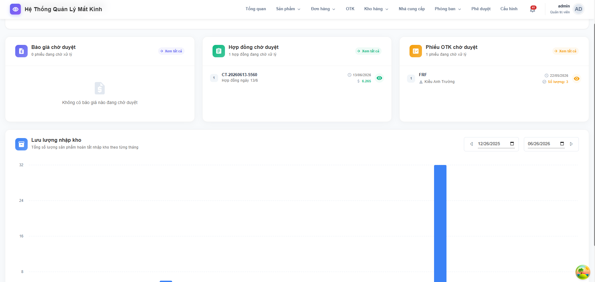
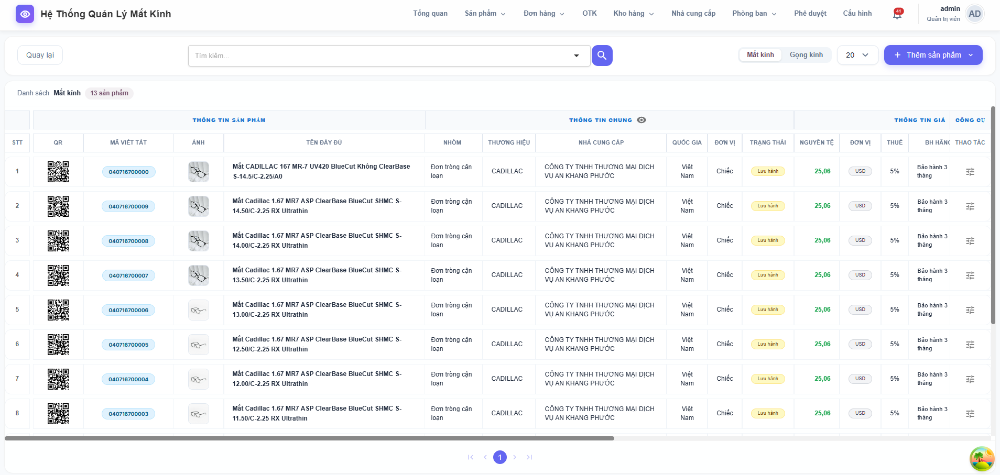
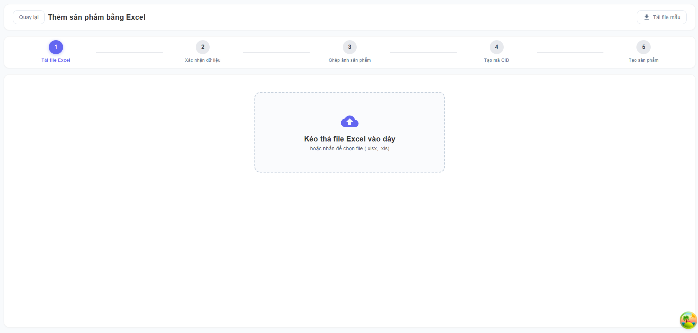
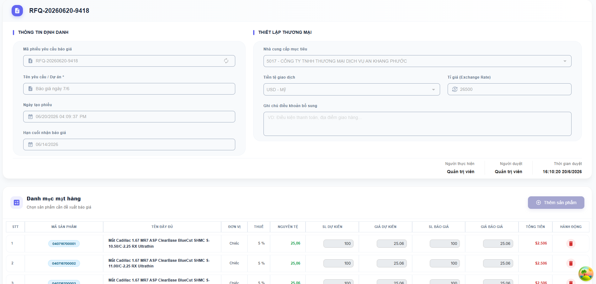
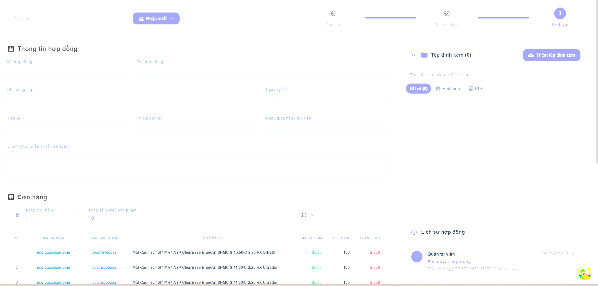
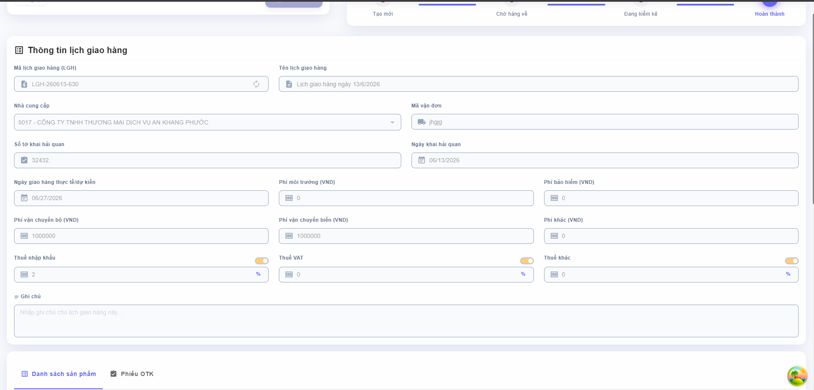
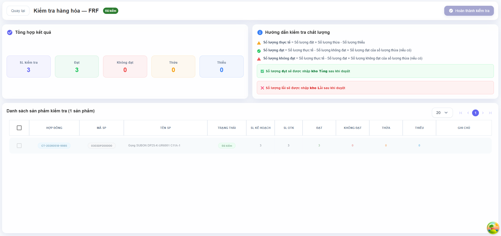
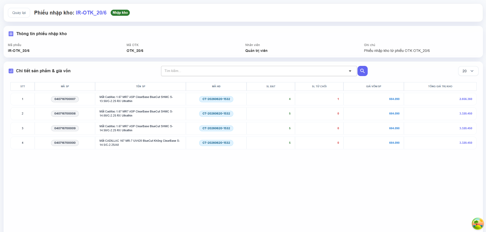
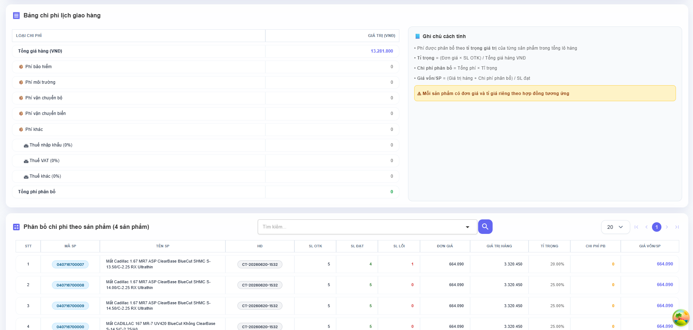

# Optic ERP - Frontend System


Optic ERP is a comprehensive, enterprise-level Web Application designed to streamline the Supply Chain and Warehouse Management processes specifically for the Eyewear Industry. It handles the complete lifecycle from Quotation, Contract Management, Delivery Scheduling, Quality Control (OTK), to Inventory Receipt and Landed Cost Allocation.

## 🚀 Key Features

*   **Supply Chain Module:** Manage Purchase Quotations, Contracts, and Delivery Schedules.
*   **Warehouse & Inventory:** Real-time inventory tracking, Quality Control (OTK), and dynamic cost allocation (Landed Cost).
*   **Excel Data Interoperability (Data Round-tripping):** Import/Export templates for Quotations and Contracts with deep client-side offline validation using `ExcelJS`.
*   **Real-time Notifications:** WebSocket (STOMP) integration for live business alerts.
*   **Role-Based Access Control (RBAC):** Secure module access and specialized views based on user roles (Admin, Procurement, Warehouse Staff, Manager).
*   **Dynamic Data Filtering:** Robust Data Grids with URL-synced pagination and complex filter states.

## 🛠 Tech Stack

*   **Framework:** React 18 / Vite
*   **Language:** TypeScript
*   **State Management & Data Fetching:** React Query (TanStack V5), Zustand / Context API
*   **Forms & Validation:** React Hook Form, Yup / Zod
*   **Styling & UI:** Material UI (MUI), SCSS
*   **Other Libraries:** Axios, ExcelJS, SockJS/STOMP (WebSockets)

## 📸 Screenshots

| Dashboard | Products | Excel Products |
|:---:|:---:|:---:|
|  |  |  |

| Quotation | Contract |
|:---:|:---:|
|  |  |

| Delivery Schedule | OTK |
|:---:|:---:|
|  |  |

| Inventory Receipt | Landed Cost |
|:---:|:---:|
|  |  |

## 💻 Running the Project Locally

### Prerequisites
*   Node.js (v18 or higher)
*   npm or yarn

### Installation Steps

1.  **Clone the repository:**
    ```bash
    git clone https://github.com/Huykhoai/Eyeglasses.git
    cd vnoptic_fe
    ```

2.  **Install dependencies:**
    ```bash
    npm install
    # or
    yarn install
    ```

3.  **Environment Variables:**
    Create a `.env` file in the root directory by copying the `.env.example` file (if available) and adding the necessary API endpoints.
    ```env
    VITE_API_URL = "http://localhost:8080"
    PORT = 3000
    VITE_PRIMARY_COLOR='#6366f1'
    VITE_SECOND_COLOR = '#714B67'
    ```

4.  **Start the development server:**
    ```bash
    npm run dev
    # or
    yarn dev
    ```

5.  Open your browser and navigate to `http://localhost:3000`.

## 📁 Project Structure

```text
src/
├── api/          # Axios interceptors and API services
├── assets/       # Static files (images, icons)
├── components/   # Reusable UI components (Layout, Menus, Dialogs)
├── context/      # React context for global state (Auth, Themes)
├── hooks/        # Custom React hooks
├── pages/        # Main route pages (Dashboard, Contract, Quote, Otk, etc.)
├── router/       # Application routing configuration
├── types/        # TypeScript interfaces and types
└── utils/        # Helper functions, formatters, constants
```

## 🔐 Security & Role Rules

-   Guest/Unauthorized users are redirected to the Login page.
-   Access to paths like `/contract/add` or `/otk` are protected by Higher Order Components requiring `ROLE_ADMIN` or specific module permissions. 
-   JWT tokens are stored securely in memory or HTTPOnly cookies to prevent XSS.

## 👥 Contributors

-   **[Your Name / Huy Khoai]** - Fullstack Developer

*This project was developed as a graduation thesis.*
